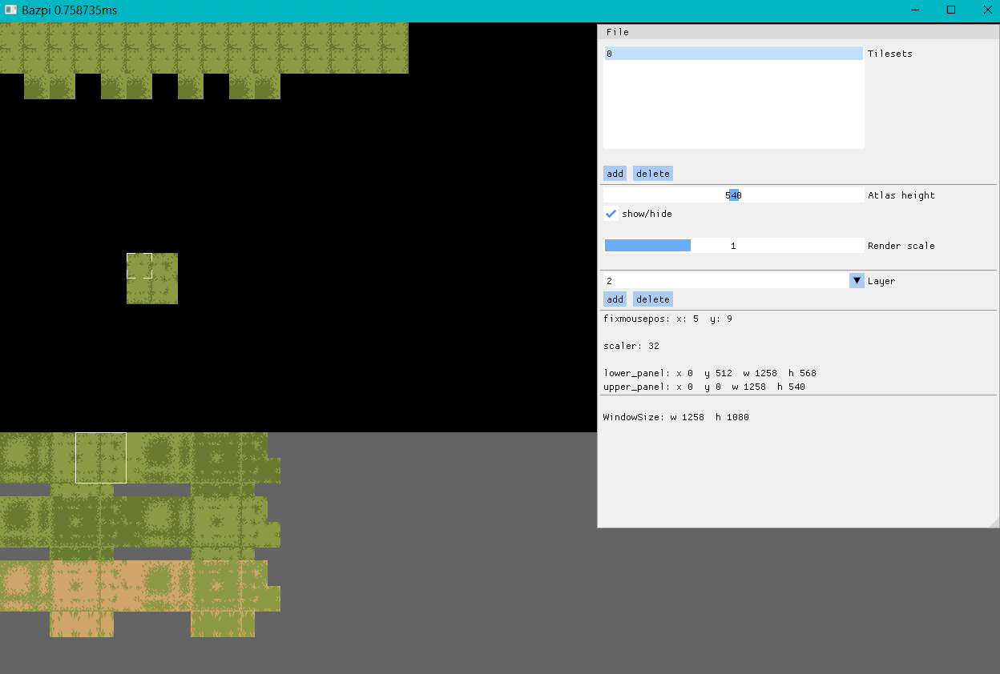

# Bazpi

simple tile editor for 2D-games based on sdl_basegame from [SDL_Basegame](https://github.com/sor/sdl_basegame).

Currently implemented functions are:

* Open and save files via native file dialog.
* Add more assets and switch between them.
* Change the global render scaling.
* Select a tile in the active tile set by clicking on it and place it individually on the map grid.
* Hold the mouse button + Ctrl to select a square from several tiles in the atlas to place them grouped on the map.
* Resizing and/or hiding the Tile-Atlas panel.
* Changing the active rendering layer

#### Annotation

The asset files are saved as relative paths starting from the project folder. Moving asset files can therefore currently lead to problems. Better save them within the "asset/graphic" folder.

#### debug-shortcuts

| Key        | Action                     |
| ---------- | -------------------------- |
| F2         | hide/show tile-atlas panel |
| F5         | save current map           |
| arrow keys | move camera                |

#### building the project

CMakeLists is used to build the project together with vcpkg to manage the required dependencies
