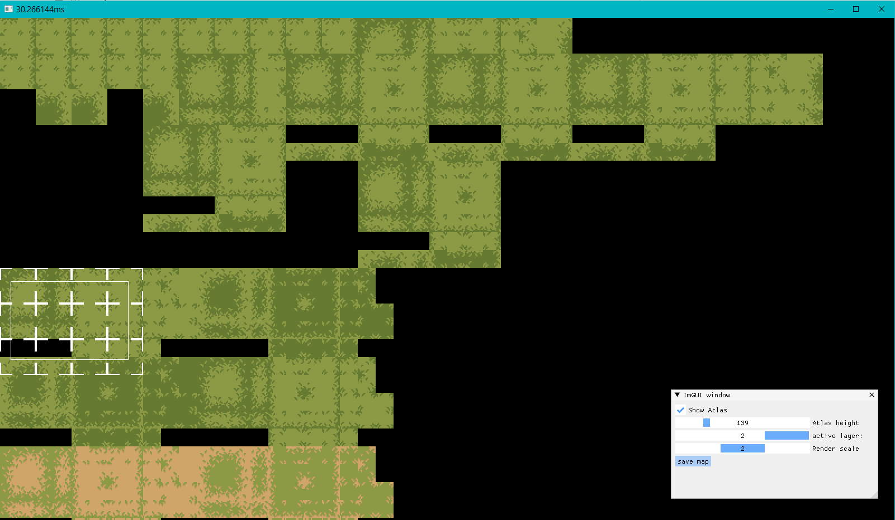

# sdl_tileeditor

Tile editor based on sdl_basegame from [SDL_Basegame](https://github.com/sor/sdl_basegame)

start with map.json in assets folder

## debug-shortcuts:

left mousebutton -

select single tile(if inside tileatlas)/ place single/multiple tile (if inside map)

right mousebutton -

delete tile

hold left mousebutton + ctrl -

selects multiple tiles in atlas

---

F2          = hide/show tile atlas panel

F5          = save map;

Arrow keys  = move camera;

Alt+F4      = quit programm

---

## building the project

This project uses CMake for building and vcpkg for managing dependencies.
