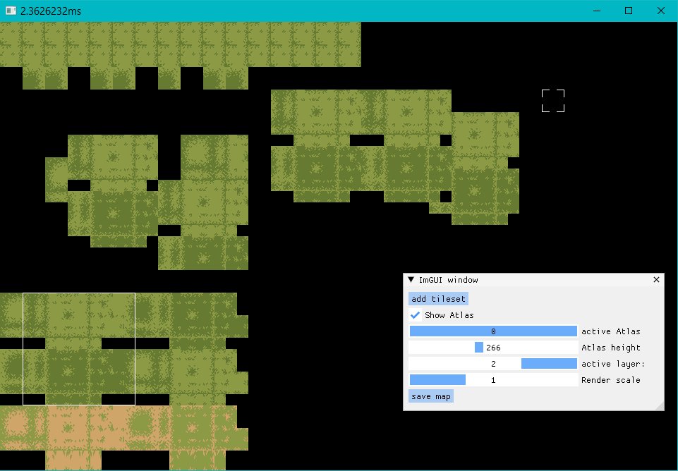

# sdl_tileeditor

simple Tileeditor for 2D-games based on sdl_basegame from [SDL_Basegame](https://github.com/sor/sdl_basegame).

Currently implemented functions are:

* Loading and saving maps in Json files.
* Open and save files via nativefiledialog.
* Add more assets and switch between them using the ImGui slider.
* Change the global render scaling with Dear ImGui.
* Select a tile in the active tileset by clicking on it and place it individually on the map grid.
* Hold the mouse button + Ctrl to select a square from several tiles in the atlas to place them grouped on the map.
* Resizing and/or hiding the TileAtlas panel.
* Changing the active rendering layer

#### Annotation

The asset files are saved as relative paths starting from the project folder. Moving asset files can therefore currently lead to problems. It is best to save them within the "asset/graphic" folder.

#### debug-shortcuts

F2          = hide/show tile atlas panel

F5          = save map;

Arrow keys  = moves the camera;

#### building the project

CMakeLists is used to build the project together with vcpkg to manage the required dependencies
